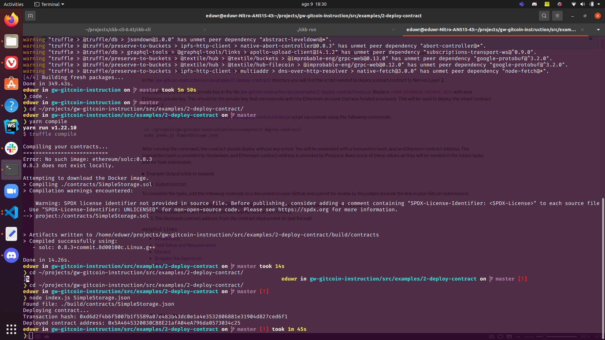

# gitcoin-hackaton-2

## A screenshot of the console output immediately after you have successfully deployed a smart contract.

## The transaction hash from the contract deployment (in text format).

[contract-hash in txt](contract-hash.txt)

## The deployed contract address from the contract deployment (in text format).

[contract address in txt](contract-address.txt)
